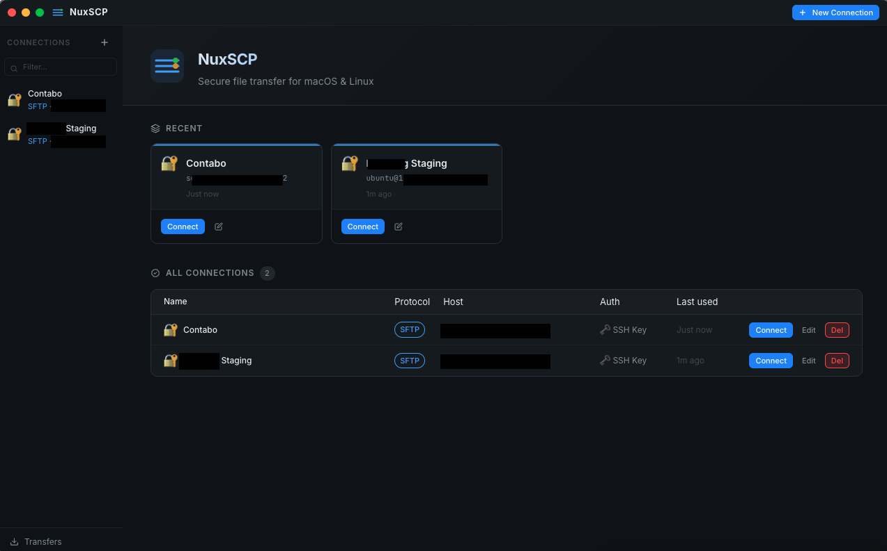
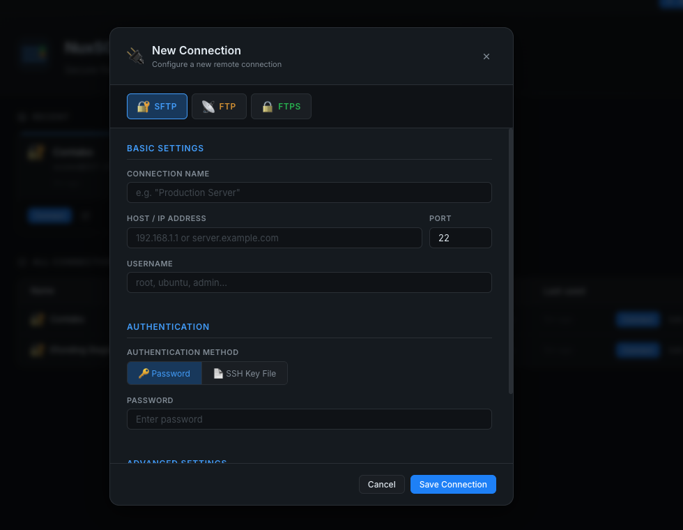

# NuxSCP

NuxSCP is a cross-platform desktop application (macOS & Linux) for secure file transfers, designed as a modern alternative to WinSCP. It provides a dual-pane file manager interface for managing files over SFTP, FTP, and FTPS with robust support for SSH keys.

## ✨ Features

> **App Preview**
> 
> <div align="center">
>  
>  <br/><br/>
>  
> </div>

- **Dual-Pane File Manager**: Side-by-side local and remote view for easy drag-and-drop or push-button transfers.
- **Protocol Support**: Connect to servers via **SFTP, FTP, or FTPS**.
- **Auth Flexibility**: Login seamlessly using Passwords, SSH key files (rsa, ed25519, pem), and passphrases.
- **Background Transfers**: Built-in transfer queue with progress bars and independent status tracking (uploading/downloading).
- **Responsive & Modern UI**: Built with a sleek macOS-native titlebar and GitHub-inspired dark mode layout. Features adjustable pane dividers (split views).
- **Connection Manager**: Keep track of and easily modify saved server connections via an embedded datastore.

## 🛠️ Tech Stack
- **Electron** (Backend & Window Management via IPC)
- **Vite** (`electron-vite` framework for blazing-fast bundling)
- **React 18** + **TypeScript**
- **node-ssh2** & **basic-ftp** (Remote file protocol drivers)

---

## 🚀 Getting Started

### Prerequisites
Make sure you have [Node.js](https://nodejs.org/) installed on your machine. (Developed with Node `v24.x` / `v20.x`).

### 1. Installation
Clone the repository, then install the dependencies using your preferred package manager:
```bash
# Using npm
npm install

# (Optional) if using yarn or pnpm
yarn install
# or
pnpm install
```

### 2. Development Setup
To boot up the application in development mode (which enables Hot Module Replacement / HMR for both React and the Electron Main Process):

```bash
npm run dev
```

The Electron app will open on your native desktop. An invisible DevServer runs in the background spanning the frontend (Vite) and backend logic concurrently.

### 3. Build & Packaging

**Check for errors (Type-checking and code bundling):**
```bash
npm run build
```

**Package into an executable format (e.g., `.dmg`, `.AppImage`, `.deb`)**:
```bash
npm run package
```
> The output binaries will be placed inside the `dist/` directory at the project root. Note that you can only package for macOS (.dmg, .app) while running this command from a macOS machine, or Linux output from a Linux machine.

## 📂 Project Structure

- `src/main/` — Electron Main Process code. Contains file drivers (`SftpDriver.ts`, `FtpDriver.ts`) and `ipc` listeners for system-level operations.
- `src/preload/` — Electron Preload script acting as a bridge (`contextBridge`) from Main to Renderer, preventing unauthorized native code access.
- `src/renderer/` — React Frontend. Contains pages (`HomePage`, `SessionPage`), UI styling (`global.css`), and UI components (like `FilePane` and `Sidebar`).

## License
MIT License
